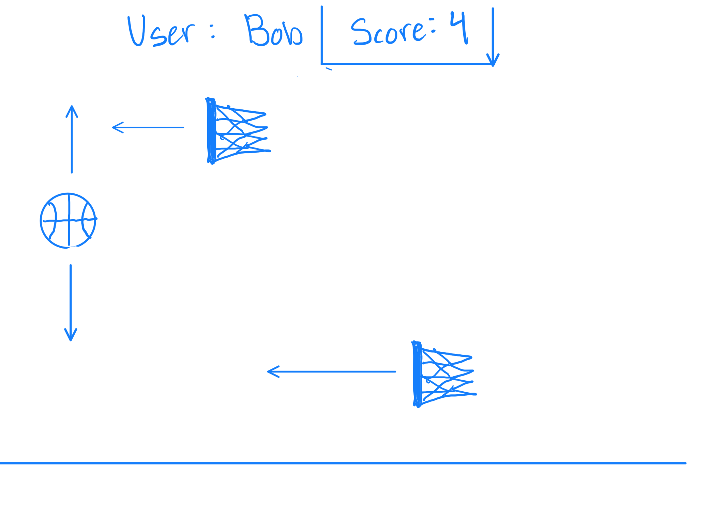
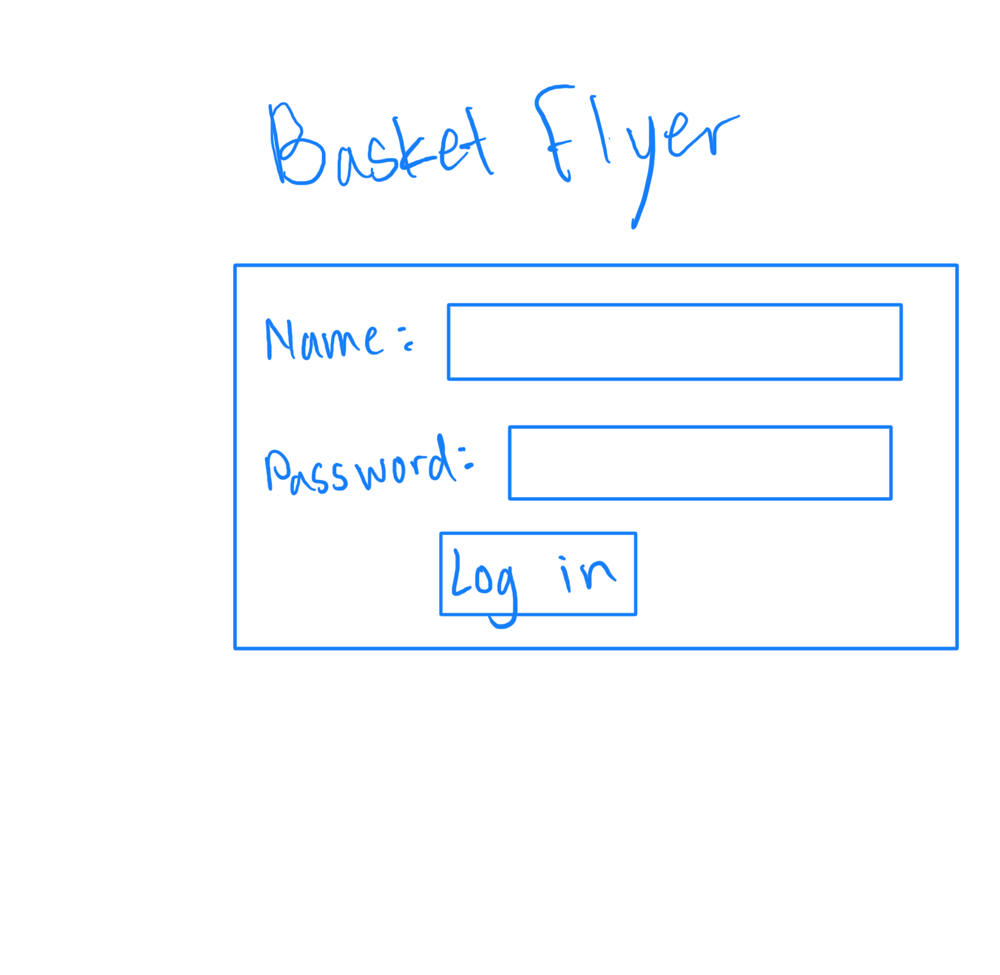
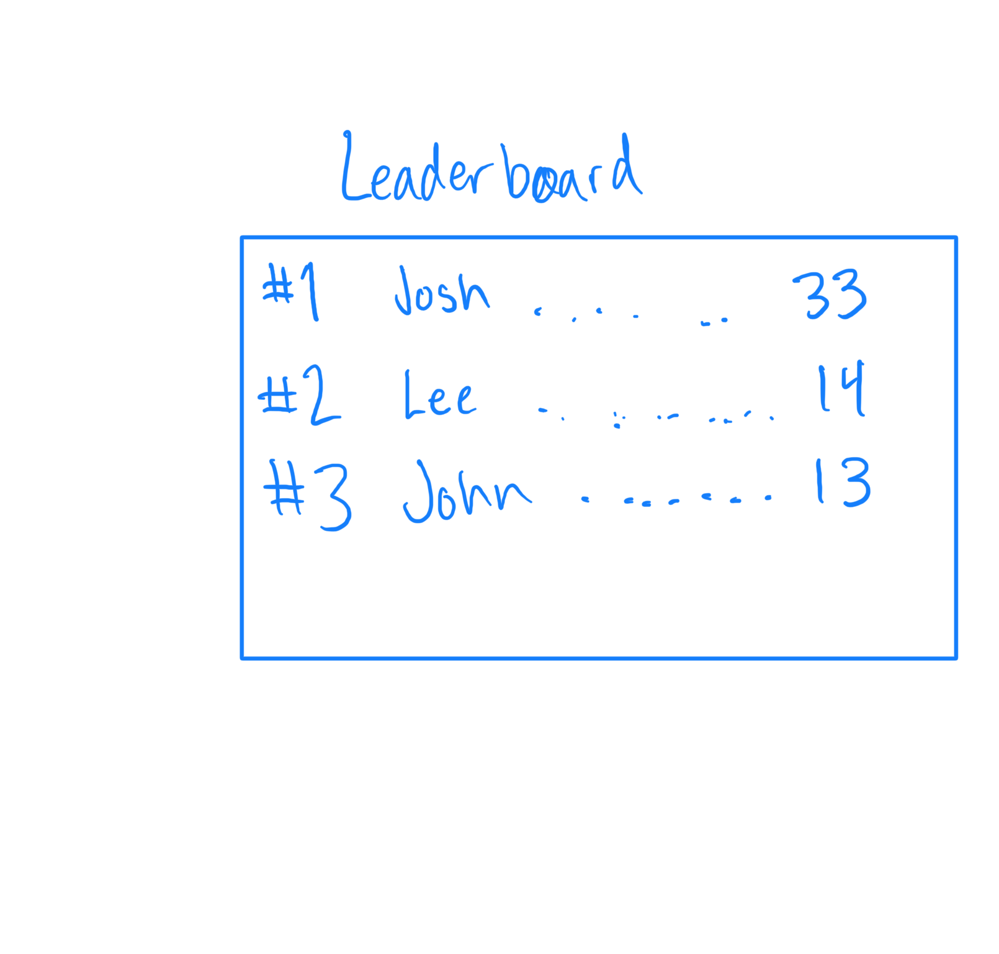

# [Basket Flyer](https://basketflyer.com)

## Specification Deliverable

### Elevator Pitch

Remember spending hours on end trying to beat your friends high score on Flappy Bird? And the satisfaction that was felt once you finally overcame that score and were able to rub it in your friends face? We all miss that simple game and competition. Basket Flyer will bring back that same feeling of competition and nostalgia from almost a decade ago. 

### Design

You can control the basketball with arrow keys and must hit the hoops as they fly across the screen.

Log-in screen

Up to date leaderboard and recent scores of your classmates.

### Key features

- Secure login over HTTPS
- Ability to select game difficulty
- Display of classmates recent scores
- Display of all-time high scores
- Display personal high score
- Ability to play or play again by pressing arrow keys
- Scores are persistently stored

### Technologies

I am going to use the required technologies in the following ways.

- **HTML** - Uses correct HTML structure for application. Three HTML pages. One for login, one for playing, and one for leaderboard. Hyperlinks to all three pages.
- **CSS** - Application styling that makes game playable on all screen sizes, uses good whitespace on log-in and leaderboard screens, color choice and contrast.
- **JavaScript** - Provides login, choice display, players in-put from arrow keys, display recent scores of classmates and all-time high scores, backend endpoint calls.
- **Service** - Backend service with endpoints for:
  - login
  - retrieving classmates scores
  - submitting personal recent scores
  - retrieving top three high-scores
- **DB/Login** - Store users, and scores in database. Register and login users. Credentials securely stored in database. Can't play unless authenticated.
- **WebSocket** - As each user plays and reaches new high scores, their scores are broadcast to all other users.
- **React** - Application ported to use the React web framework.

## HTML deliverable

For this deliverable I built out the structure of my application using HTML.

- **HTML pages** - Three HTML pages that represent structures in order to login, play, and view the leaderboard.
- **Links** - The login button requires a username and password and takes you to the game itself. Each page has links to the other pages.
- **Text** - Directions are given on the play now screen. Along with the current score text on the play now screen.
- **Images** - I use images from third party websites for the basketball, hoop, and hand.
- **3rd party Service** Invalid (Backend email verification)
- **DB/Login** - Input box and submit button for login. The Leaderboard represents data pulled from the database.
- **WebSocket** - The recent scores under the leaderboard represent the scores of realtime players.

## CSS deliverable

For this deliverable I properly styled the application into its final appearance.

- **Header, footer, and main content body**
- **Navigation elements** - I turned the navigation bar into a thick grey bar that spreads out the page links.
- **Responsive to window resizing** - My app looks great on all window sizes and devices
- **Application elements** - Used good contrast and whitespace, that is consistant on all pages.
- **Application text content** - Consistent fonts.
- **Application images** - I used a logo that I generated in place of the game name on the top of the screens.

## JavaScript deliverable

**This game is meant to be played on a computer and is only really playable on a computer**  

For this deliverable I implemented by JavaScript so that the application works for a single user. I also added placeholders for future technology.

- **Login** - When you press login, you are taken to the play now screen and your username is stored.
- **Database** - Highscores and recent scores are stored using Local Storage and are displayed on the leaderboard.
- **WebSocket** - When a player plays, their score will instantly go to the recent scores leaderboard for all to see.
- **Application logic** - Great interaction logic that lets you play the actual game on the play now screen.

## Service deliverable

**This game is meant to be played on a computer and is only really playable on a computer**  

For this deliverable I added backend endpoints that receives users and scores and returns the top 3 highs scores and recent scores.

- **Node.js/Express HTTP service** - done!
- **Static middleware for frontend** - done!
- **Calls to third party endpoints** - I used a SoundCloud API widget to put on my homescreen where you can listen to music!
- **Backend service endpoints** - Placeholders for login that stores the current user and their highscore on the server. Endpoints for new scores and updating leaderboard.
- **Frontend calls service endpoints** - I did this using the fetch function.

## DB/Login Deliverable

For this deliverable I created login authentication and now store users and scores in a database.

- **MongoDB Atlas database created** - done!
- **Stores data in MongoDB** - done!
- **User registration** - Creates a new account in the database.
- **existing user** - Stores the users highscore under the same user if the user already exists.
- **Use MongoDB to store credentials** - Stores all of the users credentials and cookies, als their highScore.
- **Restricts functionality** - A highscore will not be stored in the database unless you are logged in.
